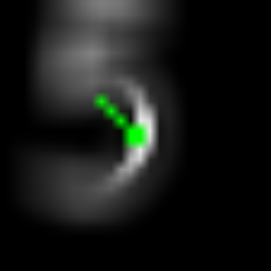
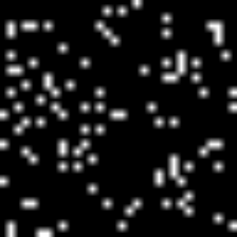
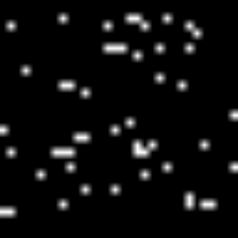

# Cortex simulation

The main goal of this repository is to test different hypotheses of how, for example, a motor cortex influences the predictions from a visual cortex. Does the SDR of eyes vector movement (saccade) increase the chance of correctly classifying the object an agent is looking at?

An _agent_ we call any system that can sense visual input and change his behavior accordingly (increase the confidence of what he sees). A _world_ is composed of **MNIST** digits.

|Retina|L4 - SDR of Retina|L23 - a composition of L4 and a motor cortex|
|---|---|---|
|  |  |  |

We use Python2.7 (blame [nupic](https://github.com/numenta/nupic) for this). 
